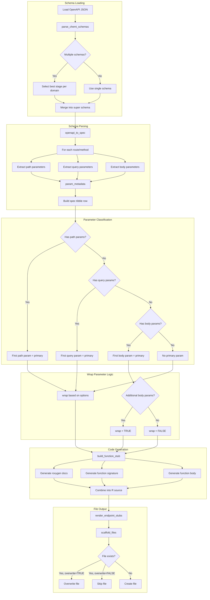
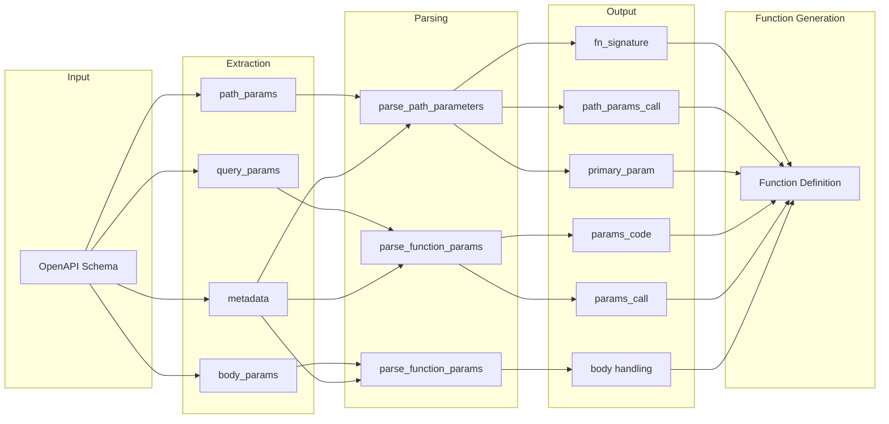
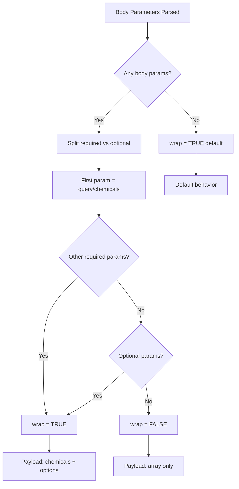

# Endpoint Evaluation Utilities Guide

## Overview

The `endpoint_eval_utils.R` script is a code generation utility that parses OpenAPI schemas and generates R function stubs for the EPA CompTox API endpoints. This document explains how the script interprets schemas and assigns function arguments, particularly for the `generic_chemi_request` function.

## Table of Contents

1. [Architecture Overview](#architecture-overview)
2. [Schema Parsing Flow](#schema-parsing-flow)
3. [Parameter Assignment Logic](#parameter-assignment-logic)
4. [The `wrap` and `tidy` Parameters](#the-wrap-and-tidy-parameters)
5. [Function Generation Pipeline](#function-generation-pipeline)
6. [Flowchart](#flowchart)

---

## Architecture Overview

The utility provides four main capabilities:

1. **OpenAPI Parsing** (`openapi_to_spec`) - Converts OpenAPI JSON to a tidy specification tibble
2. **Codebase Analysis** (`find_endpoint_usages_base`) - Searches for existing endpoint implementations
3. **Parameter Parsing** (`parse_path_parameters`, `parse_function_params`) - Extracts and organizes function parameters
4. **Code Generation** (`build_function_stub`, `render_endpoint_stubs`) - Generates R function source code

---

## Schema Parsing Flow

### Step 1: Load OpenAPI Schemas

The `parse_chemi_schemas()` function:

1. Lists all schema files matching pattern `^chemi-.*\.json$`
2. Filters out UI schemas (excluded by pattern)
3. Parses filenames to extract: `origin`, `domain`, `stage`
4. For each domain, selects the best available stage (priority: prod > staging > dev)
5. Parses each selected schema using `openapi_to_spec()`

### Step 2: Extract Endpoint Specifications

The `openapi_to_spec()` function processes each OpenAPI path:

```
For each route in openapi$paths:
    For each HTTP method (GET, POST, PUT, PATCH, DELETE):
        1. Merge path-level and operation-level parameters
        2. Deduplicate parameters by name@location
        3. Extract path parameters (in URL path like /endpoint/{id})
        4. Extract query parameters (in URL query string like ?param=value)
        5. Extract body parameters (from request body schema for POST/PUT/PATCH)
        6. Extract response content types
        7. Build specification tibble row
```

### Step 3: Parameter Metadata Extraction

For each parameter, the following metadata is extracted:

| Field | Source | Description |
|-------|--------|-------------|
| `name` | `parameter.name` | Parameter name |
| `example` | `parameter.example` or `schema.default` | Example value for documentation |
| `description` | `parameter.description` or `schema.description` | Parameter description |
| `default` | `schema.default` | Default value |
| `enum` | `schema.enum` | Allowed values (for enums) |
| `type` | `schema.type` | Data type (string, boolean, integer, etc.) |
| `required` | `parameter.required` | Whether parameter is required |

---

## Parameter Assignment Logic

### Path Parameters

Path parameters are extracted from URL placeholders like `/endpoint/{dtxsid}`:

1. **Primary Parameter**: The first path parameter becomes the `query` argument
2. **Additional Path Parameters**: Remaining path parameters go into `path_params`

Example:
- Route: `/property/{propertyName}/{start}/{end}`
- Function signature: `ct_chemical_property_predicted_by_range(propertyName, start = NULL, end = NULL)`

### Query Parameters

Query parameters are URL query string parameters (e.g., `?projection=all`):

1. If no path parameters exist, the first query parameter becomes the primary parameter
2. All query parameters are passed through the ellipsis (`...`) mechanism

### Body Parameters

For POST/PUT/PATCH endpoints, body parameters come from request body schemas:

1. Schema references (`$ref`) are resolved from `#/components/schemas/`
2. Properties are extracted with their types, defaults, and required status
3. Required parameters come first in the function signature, then optional with defaults

### Parameter Strategy

Two strategies are supported:

| Strategy | Usage | Implementation |
|----------|-------|----------------|
| `extra_params` | `generic_request` | Parameters passed via `...` to `httr2::req_url_query()` |
| `options` | `generic_chemi_request` | Parameters collected into an `options` list |

---

## The `wrap` and `tidy` Parameters

### The `wrap` Parameter

The `wrap` parameter in `generic_chemi_request` controls the JSON payload structure:

#### When `wrap = TRUE` (default)

Sends a wrapped payload with `chemicals` and `options` fields:

```json
{
  "chemicals": [{"sid": "DTXSID7020182"}, {"sid": "DTXSID1020461"}],
  "options": {"fingerprint": "toxprints", "normalize": true}
}
```

**Used when**: The endpoint accepts additional options beyond the chemical identifiers.

#### When `wrap = FALSE`

Sends an unwrapped array of chemical objects:

```json
[{"sid": "DTXSID7020182"}, {"sid": "DTXSID1020461"}]
```

**Used when**: The endpoint only accepts chemical identifiers with no additional parameters.

### Logic for Determining `wrap`

In `build_function_stub()`, the `wrap` parameter is determined as follows:

```r
# From body_param_info, parameters are split:
# - query_param: the first body parameter (becomes the 'query' argument)
# - other_required: additional required body parameters
# - optional_params: body parameters with defaults or marked optional

has_no_additional_params <- length(other_required) == 0 && length(optional_params) == 0

wrap_param <- if (has_no_additional_params) {
  ",\n    wrap = FALSE"   # Simple array, no options needed
} else {
  ""                       # Use default wrap = TRUE
}
```

**Decision flow:**
1. Parse body parameters from OpenAPI schema
2. Identify the first parameter as the `query` (typically `chemicals` or `dtxsids`)
3. Check for additional required or optional parameters
4. If no additional parameters exist → `wrap = FALSE`
5. If additional parameters exist → `wrap = TRUE` (default)

### The `tidy` Parameter

The `tidy` parameter controls the output format:

| Value | Output Format | Use Case |
|-------|---------------|----------|
| `TRUE` (default) | Tidy tibble with columns for each field | Most R workflows |
| `FALSE` | Raw list structure from JSON | Nested data, custom processing |

In generated stubs, `tidy = FALSE` is explicitly set because:
1. Cheminformatics responses often have complex nested structures
2. Allows users to decide how to flatten/process the data
3. Provides access to all response data without loss

---

## Function Generation Pipeline

### Configuration

```r
chemi_config <- list(
  wrapper_function = "generic_chemi_request",  # or "generic_request"
  param_strategy = "options",                   # or "extra_params"
  example_query = "DTXSID7020182",             # Example for documentation
  lifecycle_badge = "experimental"              # Lifecycle stage
)
```

### Pipeline Steps

1. **Parse Path Parameters** (`parse_path_parameters`)
   - Input: `path_params` string, metadata
   - Output: Function signature, path_params call, primary param

2. **Parse Query Parameters** (`parse_function_params`)
   - Input: `query_params` string, metadata, `has_path_params` flag
   - Output: Function signature, param docs, params code, params call

3. **Parse Body Parameters** (`parse_function_params`)
   - Input: `body_params` string, metadata, `has_path_params` flag
   - Output: Same as query params

4. **Build Function Stub** (`build_function_stub`)
   - Combines all parameter info
   - Generates roxygen documentation
   - Generates function body with appropriate wrapper call

5. **Scaffold Files** (`scaffold_files`)
   - Writes generated code to R/ directory
   - Handles overwrite/append logic

---

## Flowchart

### Main Processing Flow



### Parameter Flow Detail



### Wrap Decision Flow



---

## Example: Generated Function

For an endpoint with body parameters `dtxsids` (required) and `fingerprint` (optional):

**Schema:**
```json
{
  "requestBody": {
    "content": {
      "application/json": {
        "schema": {
          "$ref": "#/components/schemas/ToxprintRequest"
        }
      }
    }
  }
}
```

**Generated Code:**
```r
#' Calculate Toxprints
#'
#' @description
#' `r lifecycle::badge("experimental")`
#'
#' @param dtxsids A list of DTXSIDs to search for
#' @param fingerprint Optional parameter. Options: toxprints, chemotypes
#' @return Returns a tibble with results
#' @export
#'
#' @examples
#' \dontrun{
#' chemi_toxprint(dtxsids = "DTXSID7020182")
#' }
chemi_toxprint <- function(dtxsids, fingerprint = NULL) {
  # Build options list for additional parameters
  options <- list()
  if (!is.null(fingerprint)) options$fingerprint <- fingerprint

  generic_chemi_request(
    query = dtxsids,
    endpoint = "toxprints/calculate",
    options = options,
    tidy = FALSE
  )
}
```

For a simpler endpoint with only `dtxsids`:

```r
chemi_resolve <- function(dtxsids) {
  generic_chemi_request(
    query = dtxsids,
    endpoint = "resolver/resolve",
    wrap = FALSE,
    tidy = FALSE
  )
}
```

---

## Key Functions Reference

| Function | Purpose | Input | Output |
|----------|---------|-------|--------|
| `parse_chemi_schemas()` | Load and merge OpenAPI schemas | Schema directory | Unified spec tibble |
| `openapi_to_spec()` | Parse single OpenAPI to spec | OpenAPI list | Spec tibble |
| `parse_path_parameters()` | Parse path params | Param string, metadata | Signature, calls, docs |
| `parse_function_params()` | Parse query/body params | Param string, metadata | Signature, code, docs |
| `build_function_stub()` | Generate function code | All param info, config | R source string |
| `render_endpoint_stubs()` | Process spec to code | Spec tibble, config | Spec with `text` column |
| `scaffold_files()` | Write files to disk | Spec with text | Write result tibble |

---

## Debugging Tips

1. **Inspect parsed schema:**
   ```r
   spec <- openapi_to_spec(jsonlite::fromJSON("schema/chemi-hazard-prod.json"))
   View(spec)
   ```

2. **Check parameter metadata:**
   ```r
   spec$body_param_metadata[[1]]  # First endpoint's body params
   ```

3. **Test stub generation:**
   ```r
   stub <- build_function_stub(fn, endpoint, method, title, batch_limit, 
                                path_info, query_info, body_info, content_type, config)
   cat(stub)
   ```

4. **Enable verbose output:**
   ```r
   Sys.setenv(run_verbose = "TRUE")
   Sys.setenv(run_debug = "TRUE")
   ```
