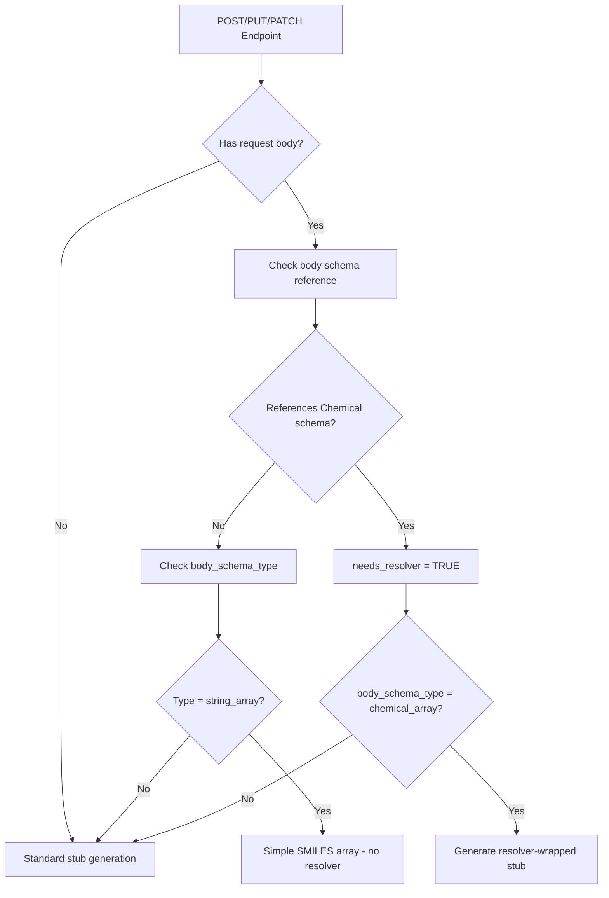
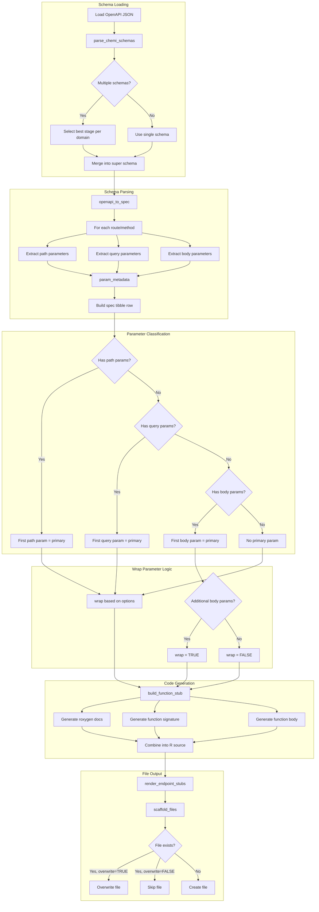
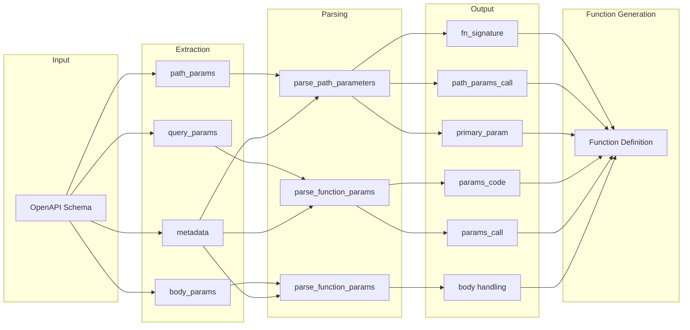
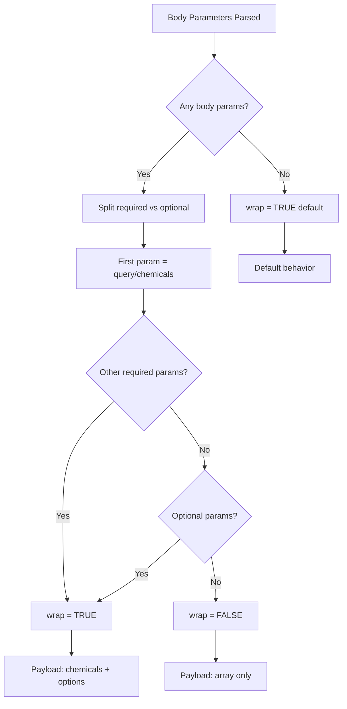
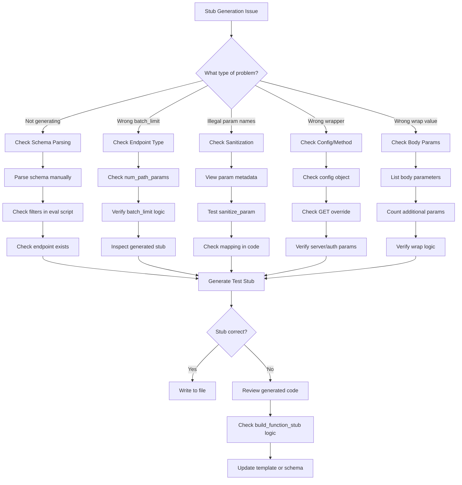

# Endpoint Evaluation Utilities Guide

## Overview

The `endpoint_eval_utils.R` script is a code generation utility that parses OpenAPI schemas and generates R function stubs for the EPA CompTox API endpoints. This document explains how the script interprets schemas and assigns function arguments, particularly for the `generic_chemi_request` function.

## Table of Contents

1.  [Architecture Overview](#architecture-overview)
2.  [Schema Parsing Flow](#schema-parsing-flow)
3.  [Parameter Assignment Logic](#parameter-assignment-logic)
4.  [The `wrap` and `tidy` Parameters](#the-wrap-and-tidy-parameters)
5.  [Resolver Wrapping](#resolver-wrapping)
6.  [Function Generation Pipeline](#function-generation-pipeline)
7.  [Flowchart](#flowchart)
8.  [Debugging Tips](#debugging-tips)
9.  [Troubleshooting Guide: Common Stubbing Failures](#troubleshooting-guide-common-stubbing-failures)

------------------------------------------------------------------------

## Architecture Overview {#architecture-overview}

The utility provides four main capabilities:

1.  **OpenAPI Parsing** (`openapi_to_spec`) - Converts OpenAPI JSON to a tidy specification tibble
2.  **Codebase Analysis** (`find_endpoint_usages_base`) - Searches for existing endpoint implementations
3.  **Parameter Parsing** (`parse_path_parameters`, `parse_function_params`) - Extracts and organizes function parameters
4.  **Code Generation** (`build_function_stub`, `render_endpoint_stubs`) - Generates R function source code

------------------------------------------------------------------------

## Schema Parsing Flow {#schema-parsing-flow}

### Step 1: Load OpenAPI Schemas

The `parse_chemi_schemas()` function:

1.  Lists all schema files matching pattern `^chemi-.*\.json$`
2.  Filters out UI schemas (excluded by pattern)
3.  Parses filenames to extract: `origin`, `domain`, `stage`
4.  For each domain, selects the best available stage (priority: prod \> staging \> dev)
5.  Parses each selected schema using `openapi_to_spec()`

### Step 2: Extract Endpoint Specifications

The `openapi_to_spec()` function processes each OpenAPI path:

```         
For each route in openapi$paths:
    For each HTTP method (GET, POST, PUT, PATCH, DELETE):
        1. Merge path-level and operation-level parameters
        2. Deduplicate parameters by name@location
        3. Extract path parameters (in URL path like /endpoint/{id})
        4. Extract query parameters (in URL query string like ?param=value)
        5. Extract body parameters (from request body schema for POST/PUT/PATCH)
        6. Extract response content types
        7. Build specification tibble row
```

### Step 3: Parameter Metadata Extraction

For each parameter, the following metadata is extracted:

| Field | Source | Description |
|------------------|---------------------|---------------------------------|
| `name` | `parameter.name` | Parameter name |
| `example` | `parameter.example` or `schema.default` | Example value for documentation |
| `description` | `parameter.description` or `schema.description` | Parameter description |
| `default` | `schema.default` | Default value |
| `enum` | `schema.enum` | Allowed values (for enums) |
| `type` | `schema.type` | Data type (string, boolean, integer, etc.) |
| `required` | `parameter.required` | Whether parameter is required |

------------------------------------------------------------------------

## Parameter Assignment Logic {#parameter-assignment-logic}

### Path Parameters

Path parameters are extracted from URL placeholders like `/endpoint/{dtxsid}`:

1.  **Primary Parameter**: The first path parameter becomes the `query` argument
2.  **Additional Path Parameters**: Remaining path parameters go into `path_params`

Example: - Route: `/property/{propertyName}/{start}/{end}` - Function signature: `ct_chemical_property_predicted_by_range(propertyName, start = NULL, end = NULL)`

### Query Parameters

Query parameters are URL query string parameters (e.g., `?projection=all`):

1.  If no path parameters exist, the first query parameter becomes the primary parameter
2.  All query parameters are passed through the ellipsis (`...`) mechanism

### Body Parameters

For POST/PUT/PATCH endpoints, body parameters come from request body schemas:

1.  Schema references (`$ref`) are resolved from `#/components/schemas/`
2.  Properties are extracted with their types, defaults, and required status
3.  Required parameters come first in the function signature, then optional with defaults

### Parameter Strategy

Two strategies are supported:

| Strategy | Usage | Implementation |
|---------------------|------------------|----------------------------------|
| `extra_params` | `generic_request` | Parameters passed via `...` to `httr2::req_url_query()` |
| `options` | `generic_chemi_request` | Parameters collected into an `options` list |

------------------------------------------------------------------------

## The `wrap` and `tidy` Parameters

### The `wrap` Parameter

The `wrap` parameter in `generic_chemi_request` controls the JSON payload structure:

#### When `wrap = TRUE` (default)

Sends a wrapped payload with `chemicals` and `options` fields:

``` json
{
  "chemicals": [{"sid": "DTXSID7020182"}, {"sid": "DTXSID1020461"}],
  "options": {"fingerprint": "toxprints", "normalize": true}
}
```

**Used when**: The endpoint accepts additional options beyond the chemical identifiers.

#### When `wrap = FALSE`

Sends an unwrapped array of chemical objects:

``` json
[{"sid": "DTXSID7020182"}, {"sid": "DTXSID1020461"}]
```

**Used when**: The endpoint only accepts chemical identifiers with no additional parameters.

### Logic for Determining `wrap`

In `build_function_stub()`, the `wrap` parameter is determined as follows:

``` r
# From body_param_info, parameters are split:
# - query_param: the first body parameter (becomes the 'query' argument)
# - other_required: additional required body parameters
# - optional_params: body parameters with defaults or marked optional

has_no_additional_params <- length(other_required) == 0 && length(optional_params) == 0

wrap_param <- if (has_no_additional_params) {
  ",\n    wrap = FALSE"   # Simple array, no options needed
} else {
  ""                       # Use default wrap = TRUE
}
```

**Decision flow:** 1. Parse body parameters from OpenAPI schema 2. Identify the first parameter as the `query` (typically `chemicals` or `dtxsids`) 3. Check for additional required or optional parameters 4. If no additional parameters exist → `wrap = FALSE` 5. If additional parameters exist → `wrap = TRUE` (default)

### The `tidy` Parameter

The `tidy` parameter controls the output format:

| Value | Output Format | Use Case |
|------------------|---------------------------------|----------------------|
| `TRUE` (default) | Tidy tibble with columns for each field | Most R workflows |
| `FALSE` | Raw list structure from JSON | Nested data, custom processing |

In generated stubs, `tidy = FALSE` is explicitly set because: 1. Cheminformatics responses often have complex nested structures 2. Allows users to decide how to flatten/process the data 3. Provides access to all response data without loss

------------------------------------------------------------------------

## Resolver Wrapping {#resolver-wrapping}

Some Cheminformatics API endpoints expect full `Chemical` objects in their request body, not just simple identifiers like DTXSIDs. These endpoints require the caller to first resolve chemical identifiers to complete Chemical objects (with `sid`, `smiles`, `casrn`, `inchi`, `inchiKey`, `mol`, etc.).

The code generator automatically detects these endpoints and generates "resolver-wrapped" functions that:

1.  Accept flexible chemical identifiers (DTXSID, CAS, SMILES, InChI, etc.)
2.  Call `chemi_resolver()` to resolve identifiers to full Chemical objects
3.  Transform the resolved data and send it to the API endpoint

### Configuration: CHEMICAL_SCHEMA_PATTERNS

At the top of `endpoint_eval_utils.R`, a constant defines which OpenAPI schema references trigger resolver wrapping:

``` r
CHEMICAL_SCHEMA_PATTERNS <- c(
  "#/components/schemas/Chemical",
  "#/components/schemas/ChemicalRecord",
  "#/components/schemas/ResolvedChemical",
  "#/components/schemas/DSSToxRecord",
  "#/components/schemas/DSSToxRecord2"
)
```

**To add new schemas that need resolver wrapping**, simply add them to this vector.

### Detection Logic

Two helper functions detect resolver-needing endpoints:

| Function | Purpose | Returns |
|----------|---------|---------|
| `uses_chemical_schema()` | Checks if request body references a Chemical schema | `TRUE` / `FALSE` |
| `get_body_schema_type()` | Classifies the body schema type | `"chemical_array"`, `"string_array"`, `"simple_object"`, or `"unknown"` |

The `openapi_to_spec()` function adds two columns to the spec tibble:

| Column | Type | Description |
|--------|------|-------------|
| `needs_resolver` | logical | Whether endpoint needs resolver pre-processing |
| `body_schema_type` | character | Classification of the body schema |

### Resolver-Wrapped Function Structure

When `needs_resolver = TRUE` and `body_schema_type = "chemical_array"`, the generator produces:

``` r
#' Endpoint Title
#'
#' @description
#' `r lifecycle::badge("experimental")`
#'
#' This function first resolves chemical identifiers using `chemi_resolver`,
#' then sends the resolved Chemical objects to the API endpoint.
#'
#' @param query Character vector of chemical identifiers (DTXSIDs, CAS, SMILES, InChI, etc.)
#' @param id_type Type of identifier. Options: DTXSID, DTXCID, SMILES, MOL, CAS, Name, InChI, InChIKey, InChIKey_1, AnyId (default)
#' @param options Optional parameter (from body schema)
#' @return Returns a tibble with results
#' @export
chemi_example <- function(query, id_type = "AnyId", options = NULL) {
  # Resolve identifiers to Chemical objects
  resolved <- chemi_resolver(query = query, id_type = id_type)

  if (nrow(resolved) == 0) {
    cli::cli_warn("No chemicals could be resolved from the provided identifiers")
    return(NULL)
  }

  # Transform resolved tibble to Chemical object format
  chemicals <- purrr::map(seq_len(nrow(resolved)), function(i) {
    row <- resolved[i, ]
    list(
      sid = row$dtxsid,
      smiles = row$smiles,
      casrn = row$casrn,
      inchi = row$inchi,
      inchiKey = row$inchiKey,
      name = row$name,
      mol = row$mol
    )
  })

  # Build options from additional parameters
  extra_options <- list()
  if (!is.null(options)) extra_options$options <- options

  # Build and send request
  base_url <- Sys.getenv("chemi_burl", unset = "chemi_burl")
  payload <- list(chemicals = chemicals)
  if (length(extra_options) > 0) payload$options <- extra_options

  req <- httr2::request(base_url) |>
    httr2::req_url_path_append("example/endpoint") |>
    httr2::req_method("POST") |>
    httr2::req_body_json(payload)

  # ... error handling ...

  result <- httr2::resp_body_json(resp, simplifyVector = FALSE)

  # Additional post-processing can be added here

  return(result)
}
```

### Resolver Wrapping Decision Flow



### Endpoints Detected for Resolver Wrapping

The following endpoint patterns typically need resolver wrapping:

-   `/api/hazard` - Hazard data lookup
-   `/api/alerts` - Chemical alerts
-   `/api/toxprints/calculate` - Toxprint fingerprint calculation
-   `/api/resolver/*` - Various resolver export endpoints
-   `/api/stdizer/chemicals` - Chemical standardization
-   `/api/services/export` - Export services

------------------------------------------------------------------------

## Function Generation Pipeline {#function-generation-pipeline}

### Configuration

``` r
chemi_config <- list(
  wrapper_function = "generic_chemi_request",  # or "generic_request"
  param_strategy = "options",                   # or "extra_params"
  example_query = "DTXSID7020182",             # Example for documentation
  lifecycle_badge = "experimental"              # Lifecycle stage
)
```

### Pipeline Steps

1.  **Parse Path Parameters** (`parse_path_parameters`)
    -   Input: `path_params` string, metadata
    -   Output: Function signature, path_params call, primary param
2.  **Parse Query Parameters** (`parse_function_params`)
    -   Input: `query_params` string, metadata, `has_path_params` flag
    -   Output: Function signature, param docs, params code, params call
3.  **Parse Body Parameters** (`parse_function_params`)
    -   Input: `body_params` string, metadata, `has_path_params` flag
    -   Output: Same as query params
4.  **Build Function Stub** (`build_function_stub`)
    -   Combines all parameter info
    -   Generates roxygen documentation
    -   Generates function body with appropriate wrapper call
5.  **Scaffold Files** (`scaffold_files`)
    -   Writes generated code to R/ directory
    -   Handles overwrite/append logic

------------------------------------------------------------------------

## Flowchart {#flowchart}

### Main Processing Flow



### Parameter Flow Detail



### Wrap Decision Flow



------------------------------------------------------------------------

## Example: Generated Function

For an endpoint with body parameters `dtxsids` (required) and `fingerprint` (optional):

**Schema:**

``` json
{
  "requestBody": {
    "content": {
      "application/json": {
        "schema": {
          "$ref": "#/components/schemas/ToxprintRequest"
        }
      }
    }
  }
}
```

**Generated Code:**

``` r
#' Calculate Toxprints
#'
#' @description
#' `r lifecycle::badge("experimental")`
#'
#' @param dtxsids A list of DTXSIDs to search for
#' @param fingerprint Optional parameter. Options: toxprints, chemotypes
#' @return Returns a tibble with results
#' @export
#'
#' @examples
#' \dontrun{
#' chemi_toxprint(dtxsids = "DTXSID7020182")
#' }
chemi_toxprint <- function(dtxsids, fingerprint = NULL) {
  # Build options list for additional parameters
  options <- list()
  if (!is.null(fingerprint)) options$fingerprint <- fingerprint

  result <- generic_chemi_request(
    query = dtxsids,
    endpoint = "toxprints/calculate",
    options = options,
    tidy = FALSE
  )

  # Additional post-processing can be added here

  return(result)
}
```

For a simpler endpoint with only `dtxsids`:

``` r
chemi_resolve <- function(dtxsids) {
  result <- generic_chemi_request(
    query = dtxsids,
    endpoint = "resolver/resolve",
    wrap = FALSE,
    tidy = FALSE
  )

  # Additional post-processing can be added here

  return(result)
}
```

### Post-Processing Pattern

All generated stubs assign the API result to a `result` variable before returning, enabling easy addition of post-processing logic. For example, see `chemi_rq()` which unnests and transforms the response:

``` r
chemi_rq <- function(query) {
  result <- generic_chemi_request(
    query = query,
    endpoint = "rq",
    server = 'chemi_burl',
    wrap = FALSE
  )

  # Post-processing: unnest and clean RQ data
  if (nrow(result) > 0 && "rqCode" %in% colnames(result)) {
    result <- result %>%
      tidyr::unnest_wider(rqCode) %>%
      dplyr::filter(!is.na(rq)) %>%
      tidyr::separate_wider_delim(rq, ' ', names = c('rq_lbs', 'rq_kgs')) %>%
      dplyr::mutate(
        rq_lbs = as.numeric(stringr::str_remove_all(rq_lbs, '\\(|\\)|\\,')),
        rq_kgs = as.numeric(stringr::str_remove_all(rq_kgs, '\\(|\\)|\\,'))
      )
  }

  return(result)
}
```

------------------------------------------------------------------------

## Key Functions Reference

| Function | Purpose | Input | Output |
|--------------------|------------------|-----------------|-----------------|
| `parse_chemi_schemas()` | Load and merge OpenAPI schemas | Schema directory | Unified spec tibble |
| `openapi_to_spec()` | Parse single OpenAPI to spec | OpenAPI list | Spec tibble with `needs_resolver`, `body_schema_type` |
| `uses_chemical_schema()` | Check if body uses Chemical schema | Request body, OpenAPI spec | `TRUE` / `FALSE` |
| `get_body_schema_type()` | Classify body schema type | Request body, OpenAPI spec | `"chemical_array"`, `"string_array"`, etc. |
| `parse_path_parameters()` | Parse path params | Param string, metadata | Signature, calls, docs |
| `parse_function_params()` | Parse query/body params | Param string, metadata | Signature, code, docs |
| `build_function_stub()` | Generate function code | All param info, config, `needs_resolver`, `body_schema_type` | R source string |
| `render_endpoint_stubs()` | Process spec to code | Spec tibble, config | Spec with `text` column |
| `scaffold_files()` | Write files to disk | Spec with text | Write result tibble |

------------------------------------------------------------------------

## Debugging Tips

1.  **Inspect parsed schema:**

    ``` r
    spec <- openapi_to_spec(jsonlite::fromJSON("schema/chemi-hazard-prod.json"))
    View(spec)
    ```

2.  **Check parameter metadata:**

    ``` r
    spec$body_param_metadata[[1]]  # First endpoint's body params
    ```

3.  **Check which endpoints need resolver wrapping:**

    ``` r
    source("endpoint_eval_utils.R")
    eps <- parse_chemi_schemas()

    # View all endpoints needing resolver
    eps[eps$needs_resolver == TRUE, c("route", "method", "body_schema_type")]

    # Check the configured schema patterns
    print(CHEMICAL_SCHEMA_PATTERNS)
    ```

4.  **Test stub generation:**

    ``` r
    stub <- build_function_stub(fn, endpoint, method, title, batch_limit,
                                 path_info, query_info, body_info, content_type, config,
                                 needs_resolver = TRUE, body_schema_type = "chemical_array")
    cat(stub)
    ```

5.  **Enable verbose output:**

    ``` r
    Sys.setenv(run_verbose = "TRUE")
    Sys.setenv(run_debug = "TRUE")
    ```

6.  **Add new schema patterns for resolver wrapping:**

    Edit the `CHEMICAL_SCHEMA_PATTERNS` constant at the top of `endpoint_eval_utils.R`:

    ``` r
    CHEMICAL_SCHEMA_PATTERNS <- c(
      "#/components/schemas/Chemical",
      "#/components/schemas/ChemicalRecord",
      # ... existing patterns ...
      "#/components/schemas/YourNewSchema"  # Add new pattern here
    )
    ```

------------------------------------------------------------------------

## Troubleshooting Guide: Common Stubbing Failures

This section provides systematic guidance for debugging when function stubs don't generate correctly.

### Problem 1: Function Not Generating at All

**Symptoms:** Running `chemi_endpoint_eval.R` or `endpoint eval.R` produces no output for an endpoint you expect.

**Debugging Workflow:**

1. **Check if endpoint was parsed:**
   ```r
   # Load the schema and check if route exists
   source("endpoint_eval_utils.R")
   eps <- parse_chemi_schemas()
   
   # Search for your route
   eps %>% filter(grepl("your-route-pattern", route))
   ```

2. **Check if endpoint was filtered out:**
   ```r
   # Check filtering logic in chemi_endpoint_eval.R lines 47-50
   # Endpoints are filtered out if they:
   # - Use PATCH/DELETE methods (not GET/POST)
   # - Match certain patterns: render, replace, add, freeze, metadata, etc.
   ```

3. **Check if endpoint already exists in codebase:**
   ```r
   # The endpoint usage search will mark it as "found" if it exists
   res <- find_endpoint_usages_base(
     eps$route,
     pkg_dir = here::here("R"),
     files_regex = "^chemi_.*\\.R$"
   )
   
   # Check for your endpoint
   res$summary %>% filter(grepl("your-route", endpoint))
   ```

**Common Causes:**
- Route is filtered by regex patterns in `chemi_endpoint_eval.R`
- Function already exists in R/ directory (check `n_hits > 0`)
- Schema file is not being loaded (check `source_file` column)
- HTTP method is not GET or POST

### Problem 2: Incorrect `batch_limit` Value

**Symptoms:** Generated function has wrong `batch_limit` (e.g., seeing `0` when you need `1`, or vice versa).

**Understanding `batch_limit`:**

| Value | Meaning | Use Case | Example |
|-------|---------|----------|--------|
| `NULL` | Default batching | POST endpoints with body | `chemi_toxprint()` |
| `1` | Single item appended to path | GET with path params | `/chemical/{dtxsid}` |
| `0` | Static endpoint, no batching | GET with only query params | `/chemicals?projection=all` |

**Debugging Workflow:**

1. **Identify endpoint type:**
   ```r
   # Check if endpoint has path parameters
   eps %>% 
     filter(route == "your-route") %>%
     select(method, num_path_params, path_params, query_params)
   ```

2. **Check the batch_limit logic:**
   - For **chemi endpoints** (in `chemi_endpoint_eval.R` line 86): `batch_limit = NA_integer_` (always)
   - For **ct endpoints** (in `endpoint eval.R` lines 90-94):
     ```r
     batch_limit = case_when(
       method == 'GET' & num_path_params > 0 ~ 1,    # Path param
       method == 'GET' & num_path_params == 0 ~ 0,   # Query only
       .default = NULL                               # POST/PUT/PATCH
     )
     ```

3. **Verify in generated stub:**
   - Search generated stub for `batch_limit = ` to confirm value
   - For GET endpoints with path params, expect: `batch_limit = 1`
   - For GET endpoints with only query params, expect: `batch_limit = 0`

**Common Causes:**
- Misidentified path vs query parameters in OpenAPI schema
- `num_path_params` not calculated correctly (check line counting)
- Chemi endpoints incorrectly using ct config (or vice versa)

### Problem 3: Parameter Name Sanitization Issues

**Symptoms:** Function won't load due to illegal parameter names like `2d`, `3d`, or names with hyphens.

**How Parameter Sanitization Works:**

The `parse_function_params()` function (lines 905-1095) handles parameter sanitization:

```r
# Sanitization logic (lines 938-946)
sanitize_param <- function(x) {
  # If starts with digit, prefix with x
  if (grepl("^[0-9]", x)) {
    paste0("x", x)
  } else {
    make.names(x)  # Handles other illegal chars
  }
}
```

**Debugging Workflow:**

1. **Check parameter metadata:**
   ```r
   # View the raw parameter names from schema
   eps %>%
     filter(route == "your-route") %>%
     pull(body_param_metadata) %>%
     .[[1]] %>%
     names()
   ```

2. **Test sanitization manually:**
   ```r
   # Test how parameter names are transformed
   source("endpoint_eval_utils.R")
   test_params <- c("2d", "3d", "my-param", "valid_param")
   sapply(test_params, function(x) {
     if (grepl("^[0-9]", x)) paste0("x", x)
     else make.names(x)
   })
   # Expected: "x2d", "x3d", "my.param", "valid_param"
   ```

3. **Verify mapping in generated code:**
   - Original name is preserved in API call: `` `2d` = x2d ``
   - Function parameter uses sanitized name: `function(x2d, x3d)`

**Common Causes:**
- Filenames with hyphens not sanitized (check `fn` generation in eval scripts)
- Parameter mapping not preserving original keys for API
- make.names() converting hyphens to dots instead of underscores

### Problem 4: Wrong Wrapper Function Used

**Symptoms:** Generated stub calls wrong wrapper (e.g., `generic_request` instead of `generic_chemi_request`).

**Understanding Wrapper Selection:**

The `build_function_stub()` function (lines 1264-1855) has special logic:

```r
# Lines 1296-1300: Force generic_request for GET endpoints
is_chemi_get <- FALSE
if (toupper(method) == "GET" && wrapper_fn == "generic_chemi_request") {
  wrapper_fn <- "generic_request"
  is_chemi_get <- TRUE  # Track this to set correct server/auth
}
```

**Debugging Workflow:**

1. **Check config:**
   ```r
   # In chemi_endpoint_eval.R (lines 32-37)
   chemi_config <- list(
     wrapper_function = "generic_chemi_request",  # For POST
     param_strategy = "options",
     ...
   )
   
   # In endpoint eval.R (lines 32-37)
   ct_config <- list(
     wrapper_function = "generic_request",
     param_strategy = "extra_params",
     ...
   )
   ```

2. **Check if forced to generic_request:**
   - ALL GET endpoints use `generic_request` (even for chemi)
   - POST/PUT/PATCH endpoints use wrapper from config

3. **Verify server and auth params:**
   ```r
   # For chemi GET endpoints (lines 1302-1306)
   # Should see: server = "chemi_burl", auth = FALSE, tidy = FALSE
   ```

**Common Causes:**
- GET endpoint configured with `generic_chemi_request` (auto-corrected)
- Missing `server` and `auth` params for chemi GET endpoints
- Wrong config object passed to `render_endpoint_stubs()`

### Problem 5: wrap Parameter Incorrectly Set

**Symptoms:** POST endpoint has wrong `wrap` value, causing payload structure mismatch.

**Understanding wrap Logic:**

From lines 1599-1607 in `build_function_stub()`:

```r
# wrap = FALSE: unwrapped array [{"sid": "..."}, ...]
# wrap = TRUE: wrapped object {"chemicals": [...], "options": {...}}

has_no_additional_params <- length(other_required) == 0 && length(optional_params) == 0
wrap_param <- if (has_no_additional_params) {
  ",\n    wrap = FALSE"  # Simple array
} else {
  ""  # Omitted = default TRUE
}
```

**Debugging Workflow:**

1. **Check body parameters:**
   ```r
   # View all body params for endpoint
   eps %>%
     filter(route == "your-route") %>%
     pull(body_param_metadata) %>%
     .[[1]]
   ```

2. **Count required vs optional:**
   ```r
   # First param is always query/chemicals
   # If ONLY that param exists -> wrap = FALSE
   # If additional params exist -> wrap = TRUE (default)
   
   body_meta <- eps$body_param_metadata[[1]]
   param_names <- names(body_meta)
   query_param <- param_names[1]  # First is query
   additional <- param_names[-1]   # Rest are options
   
   # wrap = FALSE when length(additional) == 0
   ```

3. **Verify expected payload:**
   - Check OpenAPI schema `requestBody` to see expected structure
   - Compare with generated stub's wrap parameter

**Common Causes:**
- Optional parameters not detected (check `required` field in schema)
- First parameter incorrectly identified as additional param
- Schema has nested objects that aren't parsed correctly

### Debugging Workflow Summary



### Quick Reference: Where to Look

| Issue | File | Lines | Function |
|-------|------|-------|----------|
| Schema not loading | `chemi_endpoint_eval.R` | 46-50 | Filtering logic |
| batch_limit wrong | `endpoint eval.R` | 90-94 | batch_limit assignment |
| Parameter sanitization | `endpoint_eval_utils.R` | 938-946 | `sanitize_param()` |
| Wrapper selection | `endpoint_eval_utils.R` | 1296-1300 | GET override |
| wrap logic | `endpoint_eval_utils.R` | 1599-1607 | `has_no_additional_params` |
| Resolver detection | `endpoint_eval_utils.R` | 314-369 | `uses_chemical_schema()` |
| Function naming | `chemi_endpoint_eval.R` | 100-112 | fn generation |

### Tips for Senior Developers

1. **Use the spec tibble as your source of truth:** All decisions flow from `openapi_to_spec()` output
2. **Check intermediate values:** Use browser() or print statements in `build_function_stub()` to inspect:
   - `path_param_info`, `query_param_info`, `body_param_info`
   - `is_body_only`, `is_query_only`, `has_additional_params`
   - `primary_param`, `fn_signature`
3. **Test schema changes in isolation:** Modify a copy of the OpenAPI JSON to test edge cases
4. **Review glue templates:** The actual code is generated via glue() - check line 1609+ for templates

### Tips for Junior Developers

1. **Start with the spec tibble:** Run `View(eps)` to see all parsed endpoints in a table
2. **Use cat() to see generated code:** Before writing files, use `cat(stub)` to inspect
3. **Compare working examples:** Find a similar working function and compare its schema vs generated code
4. **Check one endpoint at a time:**
   ```r
   # Filter to single endpoint for testing
   test_ep <- eps %>% filter(route == "your-specific-route")
   stub <- render_endpoint_stubs(test_ep, config = chemi_config)
   cat(stub$text)
   ```
5. **Ask: What type of endpoint is this?**
   - GET with path params? (batch_limit = 1)
   - GET with query params only? (batch_limit = 0)
   - POST with body? (batch_limit = NULL, might need wrap)
6. **Read the flowcharts:** Start with the main processing flow, then dive into specific areas